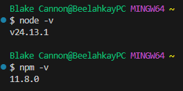

# Activity 0

## Introduction
- This activity involves installing the following tools:
    - Express: Lightweight web framework for Node.js that makes building servers and APIs easier.
    - NodeJS - Allows JavaScript to run on your computer or server, so you can build backend applications.
    - TypeScript: Adds types to JavaScript.
    
    These will be used to execute a simple Hello World RESTful API.

## Linux Installation
```
sudo apt install snapd
snap install node 
sudo snap install
```

## Node and NPM versions


## NodeJS "Hello World" Application
- Following command was executed for Hello World application
```
cd hello
gedit app.js
node app.js
```


## Express "Hello Express" Application
- Following commands were executed for Hello Express

```
cd helloex
npm init
sudo npm install express
node app.js
sudo npm install -g nodemon
sudo nodemon app.js
```


## Node.js with TypeScript
```
mkdir activity0
cd activity0/
sudo npm init
sudo npm i express
sudo npm i --save-dev typescript @types/express
mkdir src
cd src/
cp git/activity0_app.ts app.ts
sudo npm i typescript@latest -g
touch tsconfig.json
sudo tsc --init
sudo npm install -g ts-node
sudo ts-node app.ts 
```
```java
//TypeScript block
import express, { Request, Response } from 'express';

const app = express();

const port = 3000;

// Make sure you understand the following line of code.

app.get('/', (req: Request, res: Response) => {

res.send('Hello World from TypeScript!');

});

app.listen(port, () => {

console.log(`Example app listening at http://localhost:${port}`)

});
```


## Conclusion
- Activity 0 purpose was to show how to install the proper tools needed to run a Javascript Web Application, those being NodeJS, Express, Visual Studio Code and TypeScript. The three demo programs that were executing:
    - NodeJS Hello World Application
    - Express Hello Express Application
    - TypeScript Hello TypeScript Application
