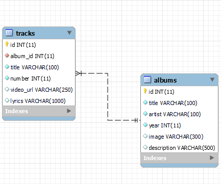
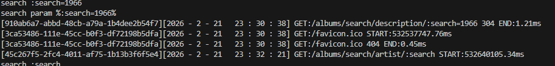

# Activity 1

## Introduction
This activity was based on learning how NodeJS is a JavaScript back-end server that is used as a foundation for Angular and React front-end development. This activity is an example of a web application interfacing to a MySQL database to produce various GET, POST, DELETE and UPDATE from the API. The architecture that it is utilizing Model View and Controller or MVC for short. 
- Model - Manages the data and business logic of the application
- View - Handles the user interface
- Controller - Acts as the middleman between model and view
## Environmental Variables


## Database Initialization


## Commands used for setup
```
cd ~/git/cv64/gcuStudent/CST391/solutions/activity1/

npm install -g nodemon
npm install dotenv
npm install cors
npm install helmet
npm install mysql
npm install uuid
npm install @types/cors --save-dev
npm install @types/dotenv --save-dev
npm install @types/mysql --save-dev
npm install @types/uuid --save-dev
npm install nodemon --save-dev
npm install ts-node --save-dev

npm start

```

## Installing Dependencies with NPM commands


## Test Images
|Method|Link|Image|
|--|--|--|
|GET|https://localhost:5000/albums|[Albums](AlbumsTest.png)|
|GET|https://localhost:5000/artists|[Artists](ArtistsTest.png)|
|GET|http://localhost:5000/albums?albumId=7|[Album Id](albumid.png)|
|GET|http://localhost:5000/albums/search/artist/:search="The Beatles"|[Artist Search](SearchArtisit.png)|
|POST|http://localhost:5000/albums/search/description/:search=1966|[Album Search Description](SearchDescription.png)|
|PUT|https://localhost:5000/albums|[Album Update](AlbumsTest.png)|
|DELETE|https://localhost:5000/:albumsid|[Album Delete](albumid.png)|
|GET|https://localhost:5000/artists|[Artists](ArtistsTest.png)|

## System Output for database connection and GET being called


## Conclusion
In this assignment I learned how to use the MVC format to create a web application that is able to connect with a SQL database to show information to a user. Learning how to setup the dependencies and SQL database was an another important aspect of this assignment, since if you do not have the correct ones install the application will not function. The database and making sure the connection work are also very import, since if your database is not setup it will not show will you try and make API requests to it.  