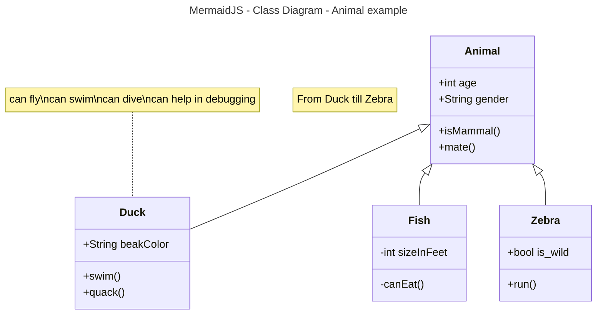

# Activity 1

This is **activity 1** ...

## Fruit List
1. Pears
2. Apples
     1. Red
     2. Yellow
     3. Green
3. Oranges 

## Fruit List
- Pears
- Apples
     - Red
     - Yellow
     - Green
- Oranges 

## Links / Images

- [wikiBob](https://gitlab.com/bobby.estey/wikibob/-/blob/master/README.md)
- [Grand Canyon University](https://www.gcu.edu/)
- [Google Website Something Else](https://google.com)


## Tables
|First Name|Last Name|
|--|--|
|Blake|Cannon|
|Jacob|Gilbreath|

## Code Blocks

```java
// Java Example
public class CodeBlock {
    public static void main(String[] args) {
        System.out.println("Code Block Example");
    }
}
```

