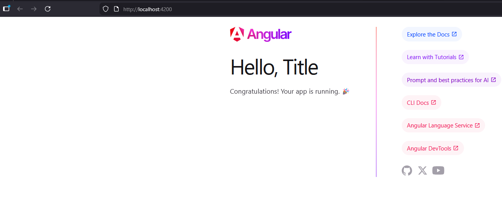
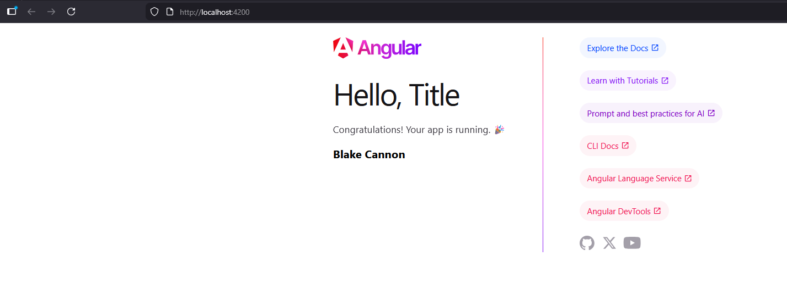

# Activity 2

## Introduction
This activity was about installing course development tools and validating installation with a simple test application. These tools were done by installing Angular and by using it to create a the test application. Then we changed basic aspects of it such as the title header and adding an extra header to include my name.

## Commands Executed
- Install the latest version of Angular

```
npm install -g @angular/cli
```
- Display the Angular Version

```
ng version
```

- Creating a new Angular project, and then calling it

```
ng new testapp
```
- Changing directory to the newly created project and starting the server
```
cd testapp
ng serve -o
```

## Screenshots of Application Running
-   Changing the title


- Adding my name to h3


## Research Questions
- node_module: Contains all the dependencies your project needs to run.
- src folder: This is the code where your application starts running. Keeps the code separate from dependencies and makes building/deployment cleaner. Typical workflow is as follows:
     - Write code in src.
     - Build tools such as TypeScript compile it.
     - output goes to folders such as dist/ or build/.
- src environments: Common settings are stored here such as API base URLs, feature flags, logging/debug tools and build mode flags.
- angular.json: Main workspace configuration file for an Angular project. Tells ANgular how to build, serve, test and deploy your application.
- package.json: Main metadata and dependency file for JavaScript/TypeScript project. Tells npm and Node.js what your project is, what it depends on, and how to run it.
- tsconfig.json: Configuration file for the TypeScript compiler. Tells TypeScript how to converts TypeScript into JavaScript.

- Explanation of how Angular generated page:
     - When the app starts, Angular loads main.ts which bootstraps the root module. That module loads the root component, and ANgular combines the component's TypeScript Logic, HTML template, and CSS styles to render the page in the browser. 

## Conclusion
This application explored how Angular is to setup and quickly launch a web application with it. Then it explored minor changes such as rewriting the title and adding an extra header by changing the component file. The research done in this activity also helped to understand each part of the web application, so we could have a better understanding of how each part is interacting. 