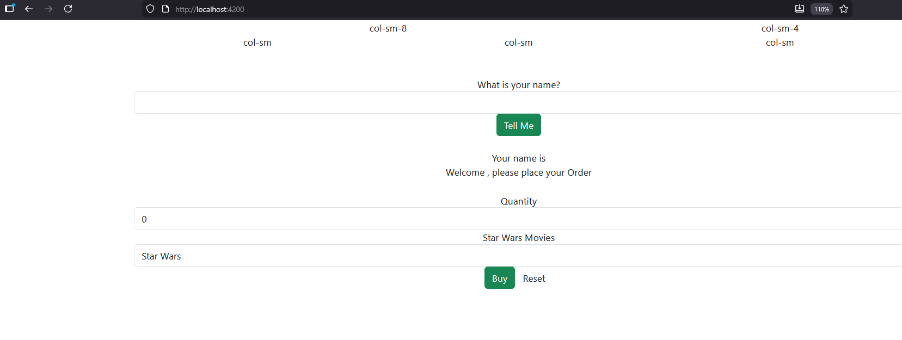
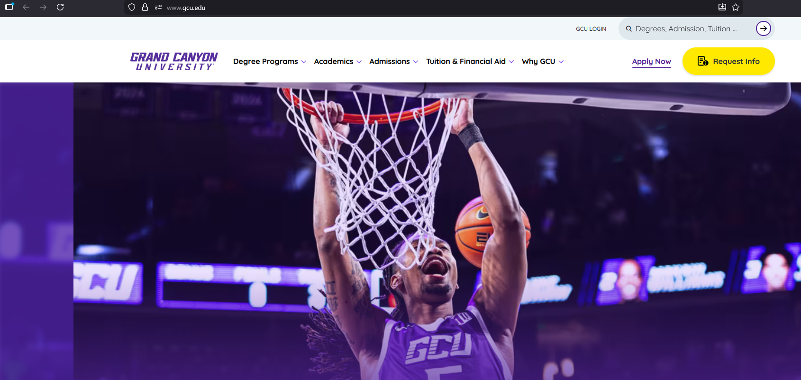
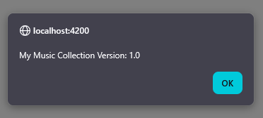

# Introduction
This project is about installing bootstrap and PopperJS for an Angular application. It revisits the music application changing and adding
key components, so the project can successfully handle the Angular for the front-end. 
## Part 1
Creating an Angular Project
```
ng new simpleapp
```
Selecting both CSS and No server-side rendering
```
✔ Which stylesheet format would you like to use? CSS             [ https://developer.mozilla.org/docs/Web/CSS                     ]
✔ Do you want to enable Server-Side Rendering (SSR) and Static Site Generation (SSG/Prerendering)? No
CREATE simpleapp/README.md (1472 bytes)
CREATE simpleapp/.editorconfig (314 bytes)
CREATE simpleapp/.gitignore (587 bytes)
CREATE simpleapp/angular.json (2602 bytes)
CREATE simpleapp/package.json (1002 bytes)
CREATE simpleapp/tsconfig.json (915 bytes)
CREATE simpleapp/tsconfig.app.json (424 bytes)
CREATE simpleapp/tsconfig.spec.json (434 bytes)
CREATE simpleapp/.vscode/extensions.json (130 bytes)
CREATE simpleapp/.vscode/launch.json (470 bytes)
CREATE simpleapp/.vscode/tasks.json (938 bytes)
CREATE simpleapp/src/main.ts (250 bytes)
CREATE simpleapp/src/index.html (295 bytes)
CREATE simpleapp/src/styles.css (80 bytes)
CREATE simpleapp/src/app/app.component.css (0 bytes)
CREATE simpleapp/src/app/app.component.html (19903 bytes)
CREATE simpleapp/src/app/app.component.spec.ts (925 bytes)
CREATE simpleapp/src/app/app.component.ts (285 bytes)
CREATE simpleapp/src/app/app.config.ts (310 bytes)
CREATE simpleapp/src/app/app.routes.ts (77 bytes)
CREATE simpleapp/public/favicon.ico (15086 bytes)
✔ Packages installed successfully.
    Directory is already under version control. Skipping initialization of git.
```
Changing directory to simpleapp directory and adding bootstrap and popperJS
```
cd simpleapp

npm install bootstrap
npm install @popperjs/core
```

Edit simepleapp/src/app/app.component.html and remove all with the following:
```
<div class="container text-center">
  <div class="row">
    <div class="col-sm-8">col-sm-8</div>
    <div class="col-sm-4">col-sm-4</div>
  </div>
  <div class="row">
    <div class="col-sm">col-sm</div>
    <div class="col-sm">col-sm</div>
    <div class="col-sm">col-sm</div>
  </div>
</div>

```

start the ANgular application
```
ng serve
```

## Viewing Bootstrap page in Browser

Example of the simple app running in bootstrap

## Part 2

Screenshots of application:

This is a view of the homepage running in angular.


GCU link working.


Shows the options for creating an album.


Show the current list of artists.


Shows the about box working and showing the current version of the music collection. 

# Conclusion
I learning how to create and run a simple application using bootstrap and having it run the front-end using Angular. Then the assignment went
back to the music app and showed us how to recreate the application to support an Angular front-end approach. 