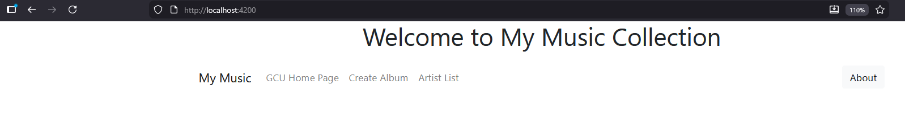
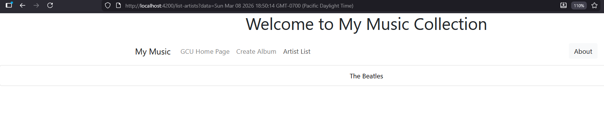
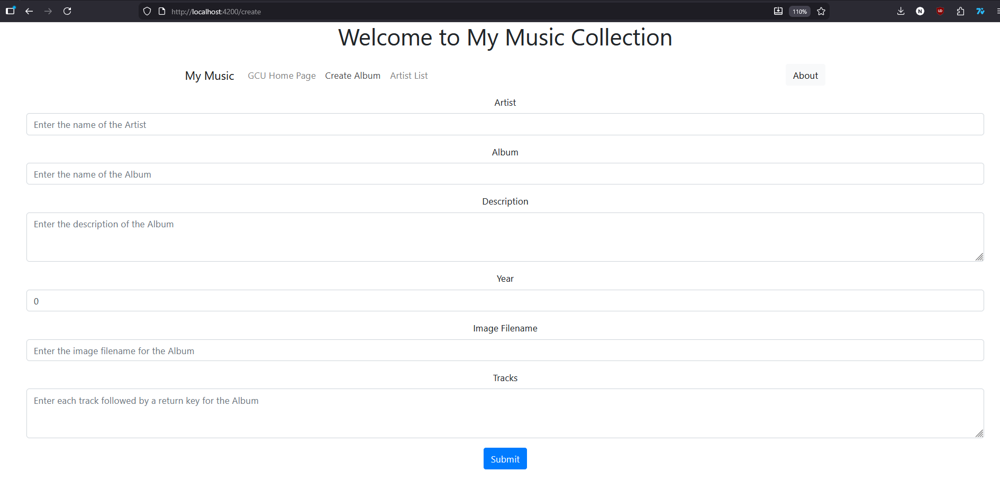

# Introduction
This assignment was about taking the existing front-end angular application we made for the music app and giving it live service data 
from the back-end instead of relying on the hard coded JSON file. 

## Activity 4 Commands
```
npm install
npm install -g
npm install jquery --save-dev
npm install bootstrap
npm install @popperjs/core
ng version
ng serve
```
These were the commands used to install the correct packages needed for the application to run. Then we use ng version to make sure we are using the correct version of the packages and ng serve started up the application, so we can see how it is functioning. 

## Screenshot Captions


- This screenshot shows the homepage of the application running in our web browser on the port of 4200. 



- This shows the application accessing the controller to retrieve the GET api that allows angular to show the user the list of artists currently in the database.




- This shows the application accessing the controller to retrieve the POST api that will allow the angular to take in user input then create a new album within our SQL database.

# Conclusion
Overall this activity shows how to move from a hard coded source of data to a live source of data using a SQL database. This is done through changing our code to accommodate using back-end services we created earlier.