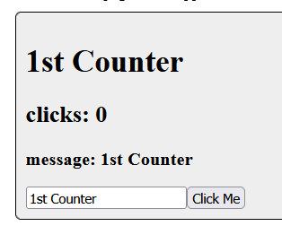
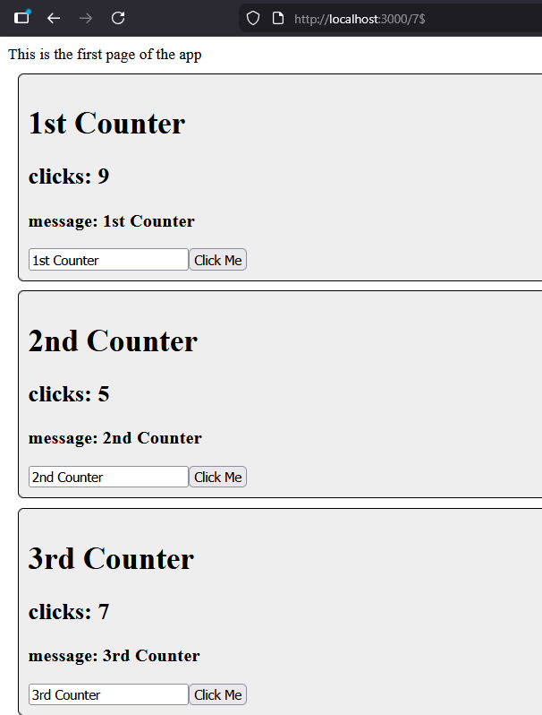
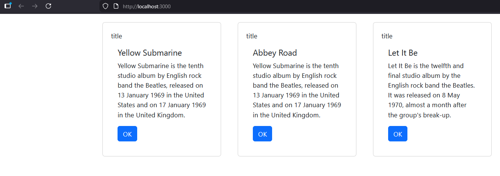

# Activity 5
- Blake Cannon
- March 22, 2026

## Introduction

This assignment is a introduction into how to build a React web application by transforming our old music application into one that supports React front-end.

## Activity 5 Commands

```
mkdir activity5
cd activity5
npx create-react-app music
cd music/src
rm -rf *
cp ../../../../docs/topic05index.js
npm i bootstrap
npm start
```

## Screenshots

### Statechanger App


- This screenshot shows the website loading a different props or components so the user can view them.


- Screenshot shows the website changing the state of the different components on webpage these being the clicks being track by pressing "Click Me".


### Music App using React


- This screenshot shows the web application running and successfully using React scripts to produce card images.


# Conclusion 
Overall in this assignment I learned what is needed for and how React web applications function. React has a component-Based structure in that everything is a component. This allows it to be small and reusable throughout the web application. It also uses something called a Virtual DOM, which creates a lightweight copy of the real webpage. Data is also managed throughout a React app with state and props which a 'state' is internal data and 'prop' is an external data. All these parts of a React work together to create a web application that has reusable components and a virtual DOM to efficiently update the user interface when data changes, without reloading the entire page. 