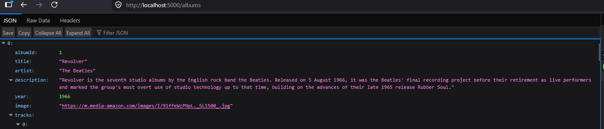
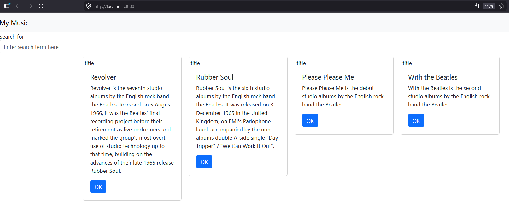
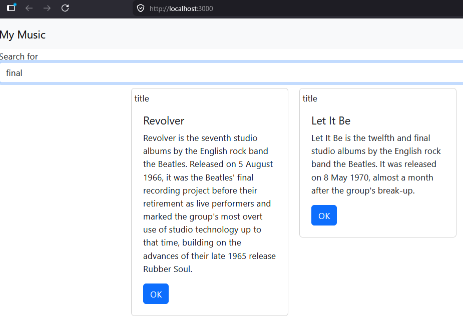

# Activity 6
- Blake Cannon
- Date: March 29, 2026

## Introduction
- This activity explained how to expand the react application we made in the last one to be able to handle retrieving data from a back-end. This is also expanded with allowing the web application to filter the albums by looking for keywords in the albums descriptions. 

## New Features
- Using Axion to retrieve data from the back-end application
- Adding NavBars to the web application
- Using a filter bar to filter the music albums by description

## Screenshots

- This screenshot shows the application pulling from the backend correctly and filling out the homepage with the different albums from the beetles.

- Using the search bar we can filter for the keywords within the album descriptions and have only those show up within the card views.

# Conclusion
- This activity demonstrated how to take a basic React application and enhance it into a more dynamic, data-driven web app by integrating a back-end service. By using Axios to retrieve data, the application is now capable of displaying real-time information rather than relying on static content. The addition of navigation components improved the overall structure and user experience, making the app easier to use and more organized.

The implementation of a search/filter bar further increased usability by allowing users to quickly find albums based on keywords in their descriptions. Overall, this activity highlighted the importance of connecting front-end and back-end systems, as well as building interactive features that improve how users engage with the application.

