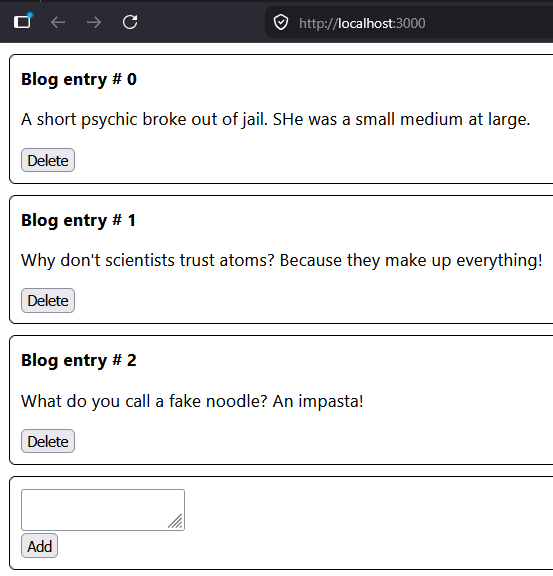
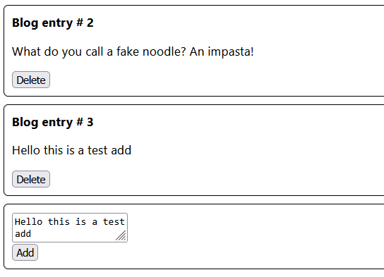
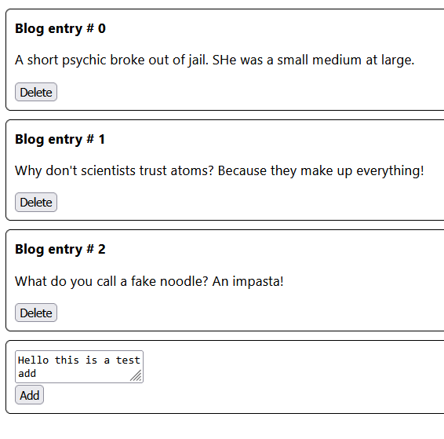
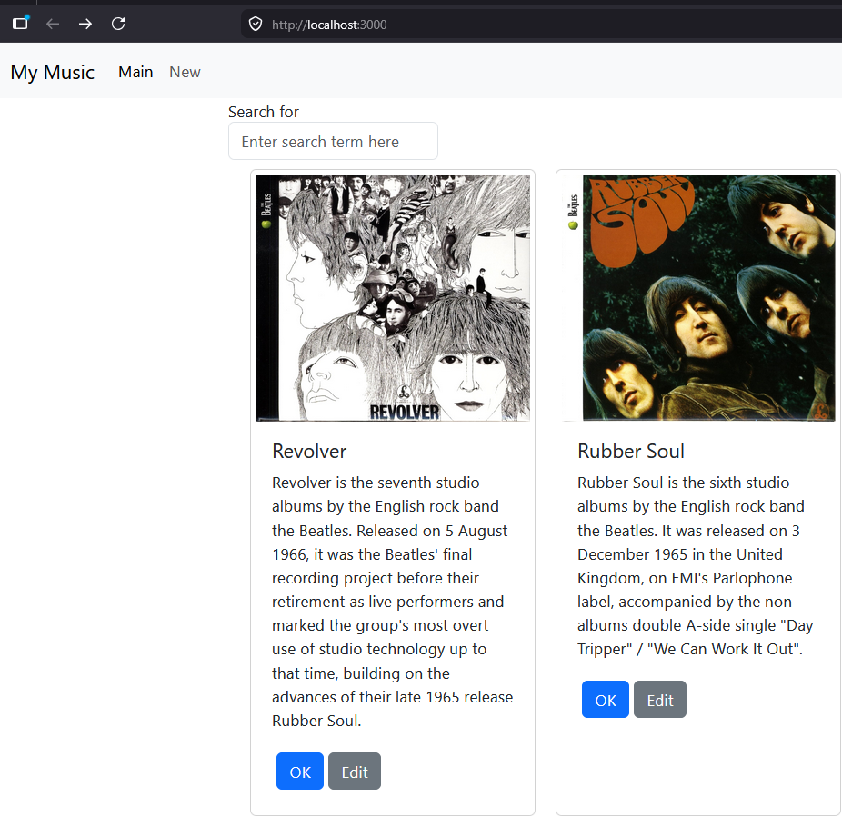
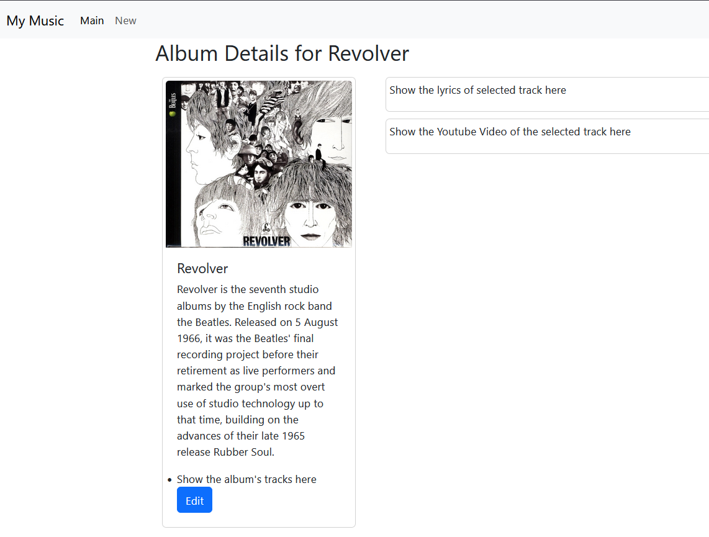
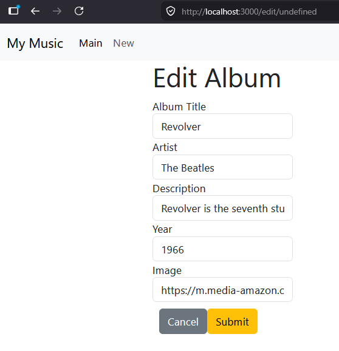
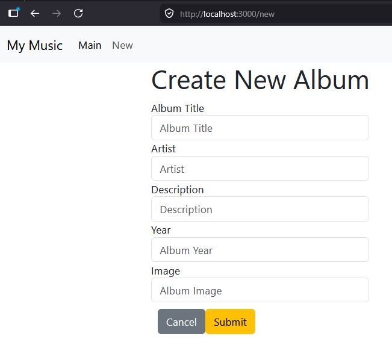

# Activity 7
- Blake Cannon
- March 29, 2026

## Introduction
- In this activity we learned how to make dynamic components that change depending on how the user interacts with them. In terms of the music application we can edit the details updating the database and web application in real time showing so the user can see them.

## New Functions added to Music App
- New Album function added to web application
- Ok button added to component of albums list
- Edit button added to component of albums list

## Commands Used
```
npx create-react-app blog
cd blog
npm start
```
- Used to create the dynamic_components_demo application. 

```
cd activity1/MusicAPI
npm start
```
- Opens up the backend music application.

```
cd activity7/music
npm start
```
- starts the front-end music web application for the React showcase.

## dynamic_components_demo Screenshots

- This shows the different components being shown to the base web page. It shows how it represents each blog and how the button for delete is being tied to each component. 


- Showing that the add button functions and adds a fourth blog post to the web application based on what is typed within the text box.


- This is demonstrating the delete button functioning by deleting the fourth blog post the add function created in the previous screenshot. 

## Music Application Screenshots

- We can now see the album covers for the different albums being pulled from our database be put into our components so the user can view them on the web application. Shorting the search bar, so it is being presented better and also adding a 'new' button to our navbar so users can add albums to the database.


- By pressing the ok button component we can view the album and see additional details about it. Once the lyrics and youtube link are properly placed within the database it will provide the lyrics of the song and even an embedded link to the various tracks from the album.


- By pressing the edit button within the additional album details section we can go to an edit page which allows details of the album to be changed and submitted back to the database. This allows users to update and change information about it to keep it up to date. 


- By clicking the new button the user is able to create new albums to add to the database. The different text boxes allow the user to enter various data about the album then gets saved once the user click submit. They can also cancel out of this by clicking cancel and returning back to the main homepage of the web application.


# Conclusion
- This activity reinforced the practical use of dynamic components in a React application and demonstrated how user interactions can directly influence both the front-end interface and back-end data in real time. By adding features such as creating new albums and implementing edit and confirmation actions, the application became more interactive and user-focused. Additionally, working with both the front-end and backend environments highlighted the importance of proper project structure and communication between components and APIs. Overall, this exercise strengthened understanding of state management, component interaction, and real-world application behavior, providing a solid foundation for building more complex and responsive web applications in the future.
