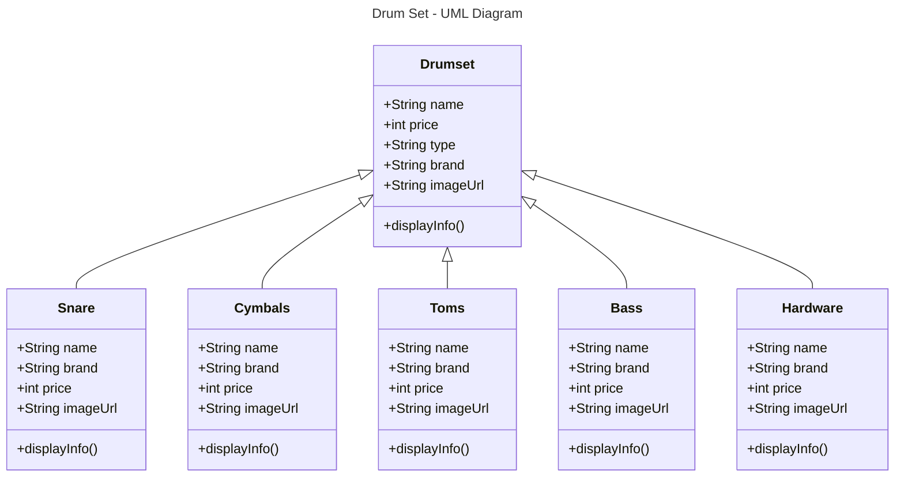
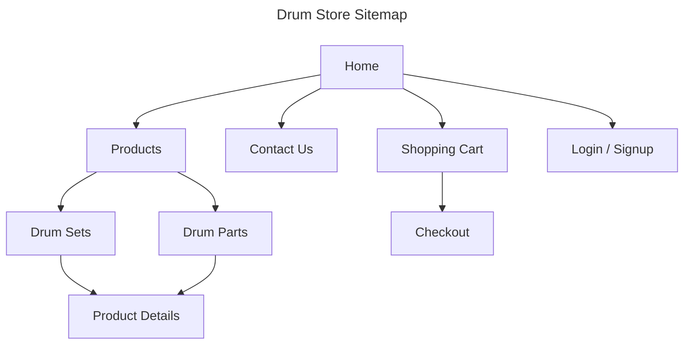
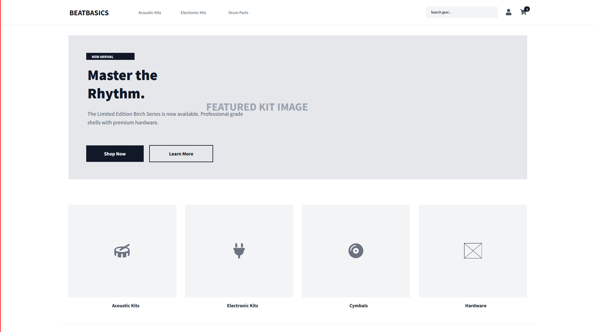

# MileStone 1
- Author Blake Cannon
- Date: February 15, 2026

# :rocket: Introduction
This project will be a creation of a store front that will primarily look to sell DrumSets to customers with the option to buy invdivual parts such as the snare, toms, cymbals, bass, hardware, and drum heads. The main idea behind the front-end is to allow users to navigate the web application and be able to choose DrumSets that interested them, so they can purchase it and have it sent to them. There is an another option though, where if they are not looking for full DrumSets and instead need specific parts they can purchase those also. This gives users a wide arrange of options to look through and find something that fits their needs. 

# :hammer: Functionality Requirements
- As a buyer, I want to be able to searched through different brands of drum sets with images, names and prices so I quickly browse products.
- As a buyer, I want to be able to pick a certain drum part with images, names, and prices so I can quickly browse through parts I am interested in.
- As a buyer, I want to easily navigate between product categories, so that I can find what I'm looking for without confusion.
- As a buy, I want to be able to click on a drum set to view more details, so that I can learn about its features before making a decision.
- As a developer, I want to create reusable UI components, so that the front-end code is modular and easy to maintain.

# :drum: UML Diagram

# :world_map: Sitemap

# :framed_picture: Wireframe

