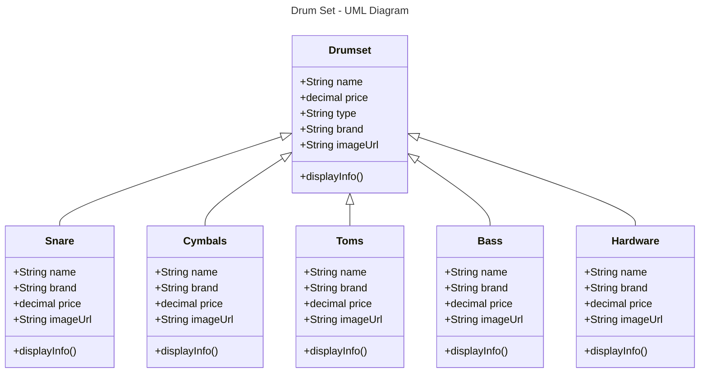
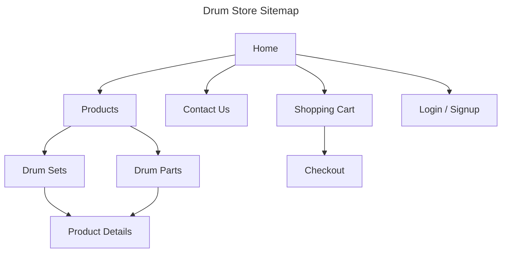
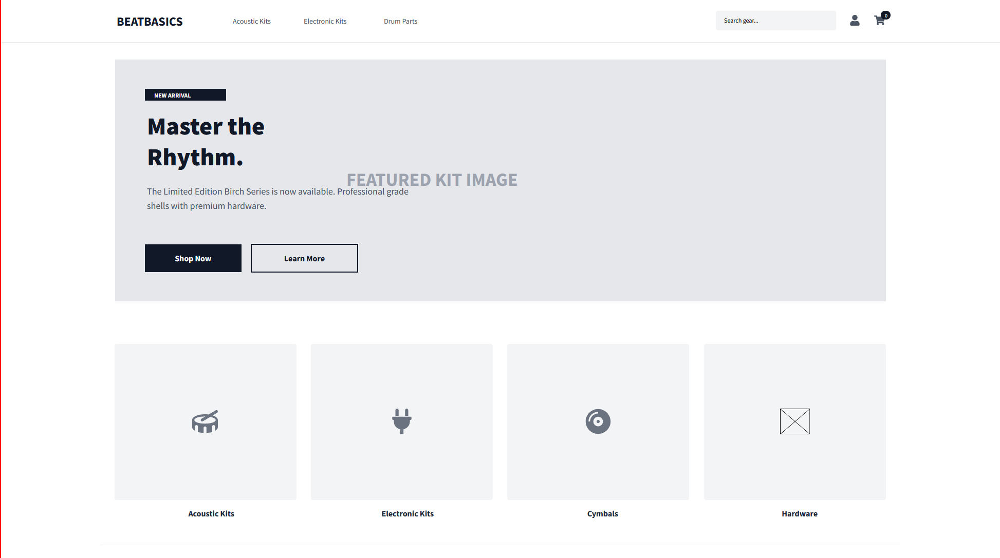
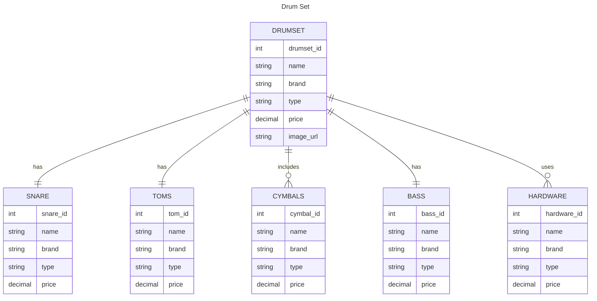

# MileStone 5
- Author Blake Cannon
- Date: March 29, 2026

# :rocket: Introduction
This project will be a creation of a store front that will primarily look to sell DrumSets to customers with the option to buy invdivual parts such as the snare, toms, cymbals, bass, hardware, and drum heads. The main idea behind the front-end is to allow users to navigate the web application and be able to choose DrumSets that interested them, so they can purchase it and have it sent to them. There is an another option though, where if they are not looking for full DrumSets and instead need specific parts they can purchase those also. This gives users a wide arrange of options to look through and find something that fits their needs.

# Link to Milestone 5 Presentation
- https://www.loom.com/share/b7416d6997cc47a7abae2d7e902b8e05

# :hammer: Functionality Requirements
- As a buyer, I want to be able to searched through different brands of drum sets with images, names and prices so I quickly browse products.
- As a buyer, I want to be able to pick a certain drum part with images, names, and prices so I can quickly browse through parts I am interested in.
- As a buyer, I want to easily navigate between product categories, so that I can find what I'm looking for without confusion.
- As a buy, I want to be able to click on a drum set to view more details, so that I can learn about its features before making a decision.
- As a developer, I want to create reusable UI components, so that the front-end code is modular and easy to maintain.

# :satellite: Still need to be Implemented
- Updating Angular and React web application with the appropriate imageUrls

# :drum: UML Diagram



# :world_map: Sitemap



# :framed_picture: Wireframe


# :floppy_disk: Database ER Diagram


## :zzz: REST Endpoints

|Method|Endpoint|Description|
|--|--|--|
|GET|drumsets|Get list of drum sets|
|GET|drumsets/:id|Get a drum set|
|POST|drumsets|Create a drum set|
|PUT|drumsets/:id|Update a drum set|
|DELETE|drumsets/:id|Delete a drum set|

## :notes: API Example of API request
```json
    GET /drumsets?drumsetId=3
    Response
    [
        {
            "drumset_id": 3,
            "name": "Roland TD - 07",
            "brand": "Roland",
            "type": "Electronic",
            "price": 699.99,
            "image_url": "insert image url for td-07",
        }
    ]

```

## :memo: Conclusion
This milestone demonstrated the continued development of a drumset web application using React, highlighting the power and flexibility of component-based design. Throughout this phase, key features such as dynamic rendering, state management, and user interaction were implemented to create a more responsive and engaging experience. By leveraging React’s ability to efficiently update the UI, the application became more scalable and easier to maintain.

Additionally, this milestone reinforced important concepts such as props, component structure, and handling data flow between components. Challenges encountered during development, including debugging and managing asynchronous behavior, provided valuable hands-on experience that strengthened overall problem-solving skills.

Overall, this milestone represents significant progress toward building a fully functional drumset application. It lays a strong foundation for future enhancements, such as improved UI design, expanded sound libraries, and more advanced interactivity, bringing the project closer to a polished and user-friendly final product.